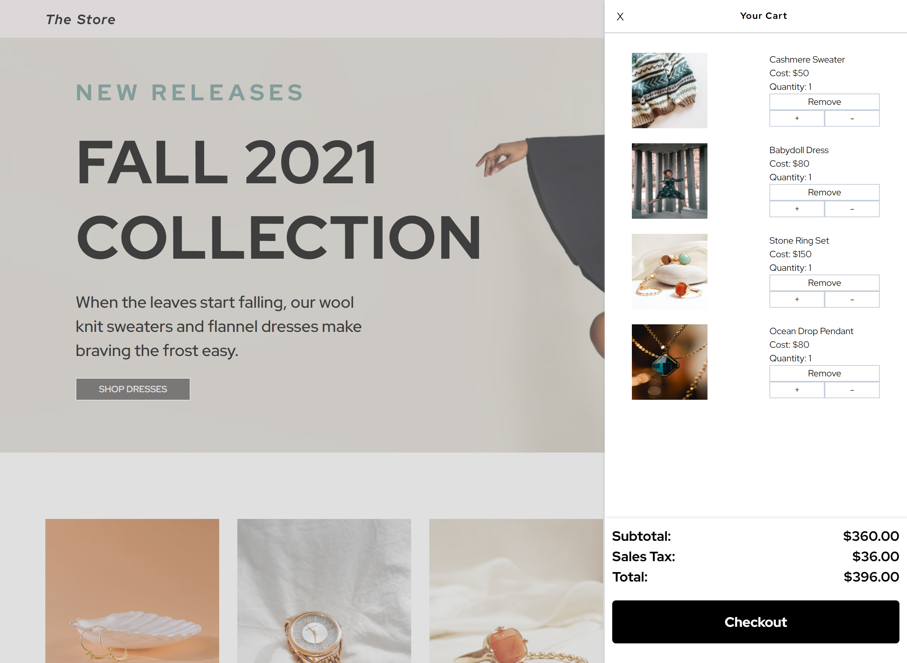
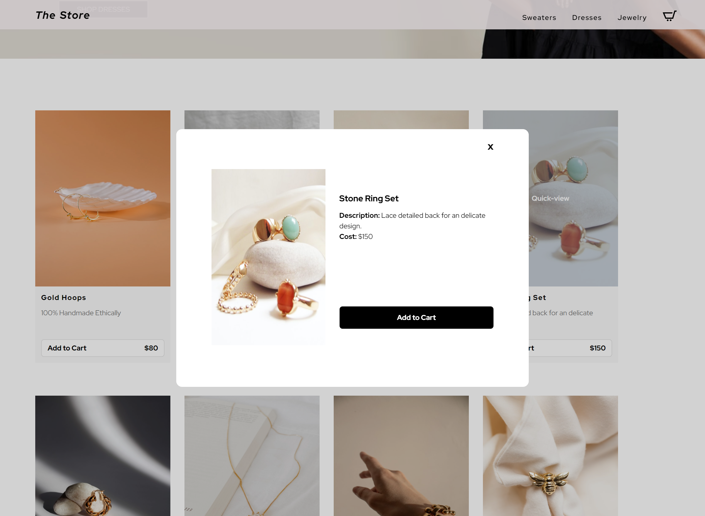

# THE STORE - E-COMMERCE SITE

An E-Commerce site that asynchronously populates product categories through processing JSON data. Local storage repopulates the user's cart when revisiting the E-Store. The checkout popup includes form validation.

live: https://thestoreco.web.app/

## Table of contents

- [Overview](#overview)
  - [Screenshot](#screenshot)
- [My process](#my-process)
  - [Built with](#built-with)
  - [What I learned](#what-i-learned)
  - [Challenges](#challenges)
  - [Continued development](#continued-development)
- [Author](#author)
- [Acknowledgments](#acknowledgments)

## Overview

### Screenshot

Overview:

Home:

Cart:

Quickview:

## My process

### Built with

- Semantic HTML
- SCSS
- JavaScript
- AJAX
- JSON
- Flexbox
- CSS Grid
- Local Storage

### What I learned

- Set and get local storage
- Build on traversing the DOM
- Use JS to build out elements with children as users select categories
- Build on AJAX techniques
- Creating and accessing JSON data
- Building and Manipulating Objects in JS

### Challenges

The greatest challenge with this project has been browser compatibility with Safari. There is a bug that is not allowing the subtotal to be set to zero when the last product is removed from the cart. I've tried using BrowserStack to find the bug that is causing this issue, however, this service is not free or affordable for personal use. I'm allowed one minute to access the dev tools before it times out. In the future I will build my projects out in React since it alleviates browser compatibility issues.

### Continued development

I would like to rebuild this project in the future in React. I'd also like to build more on the checkout page by integrating Stripe API.

## Author

- Website - [Alisar Fares-Boulos](https://www.alisarfaresboulos.com)

## Acknowledgments

Design Inspiration came from the following:
https://www.glossier.com/
